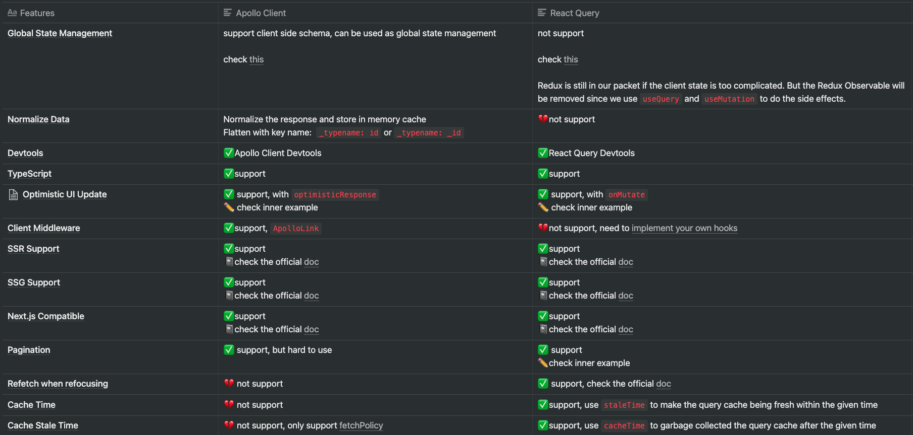

# GraphQL fullstack project with Nx, NestJS and Next.js

We want to compare React Query and Apollo Client. So this project create one GraphQL server and two frontend applications with React Query and Apollo Client.

After my comparison, I will choose to use React Query instead of Apollo Client.

Check this [Notion Table](https://www.notion.so/junyiacademy/GraphQL-Client-Side-8ba2894c6ff949e9a2d6d1af944826f9) For more detail.

## Frontend (Apollo Client) 😣😣😣

### Start server

- `$ nx serve frontend-apollo-client`
- open `http://localhost:4200/`

## Frontend (React Query) 😍😍😍

### Start server

- `$ nx serve frontend-react-query`
- open `http://localhost:4200/`

### Run unit tests

- `$ npm run test frontend-react-query`
- `$ npm run test frontend-react-query -- --watch` (watch mode)

## GraphQL Server

### Start server

- `$ nx serve graphql-server`
- open `http://localhost:3333/graphql`

### Generate types by schema

- `$ npm run graphql:type-generator`
- open `libs/util-graphql-interface/src/lib/graphql.schema.ts`

### Initialize a module

- `$ cd apps/graphql-server/src/app/modules`
- `$ nest g resource <module_name>`
